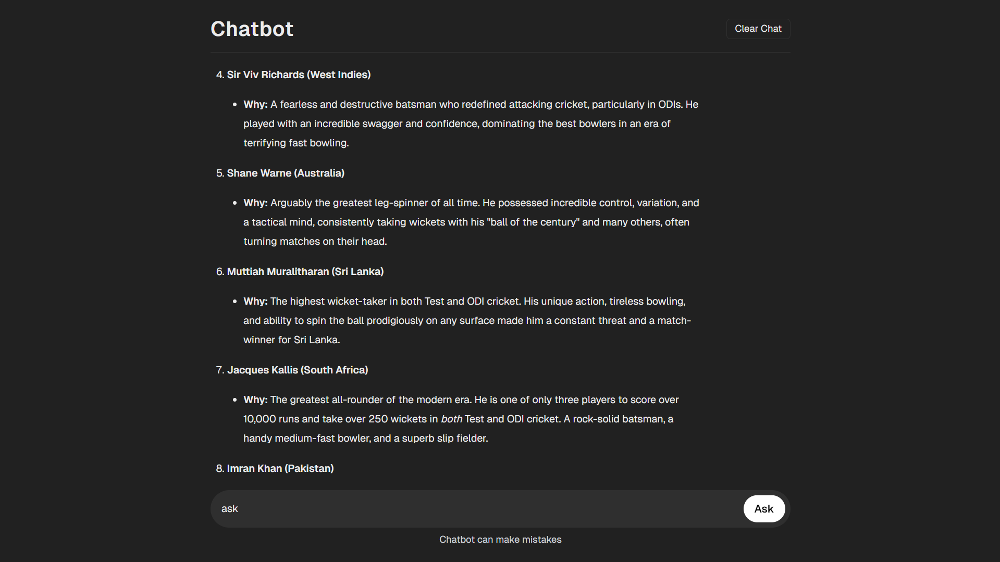
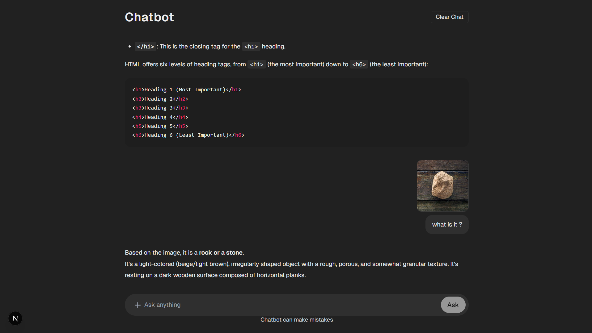

# 🤖 DeepChat Assistant — AI Chat Application

Chatbot is a modern AI Chat App inspired by Google’s Gemini and ChatGPT.  
It allows users to interact with an AI model in real time using the **Gemini API**, built with **Next.js**, **Axios**, **Framer motion**, **Material Ui** and **TailwindCSS**. The app supports smooth message and image flow, animations, and persistent chat storage.

---

🚀 **Live Demo:** [ DeepChat-Assistant ](https://deepchat-assistant.vercel.app)

---

## ✨ Features

- 💬 Real-time AI chat responses
- ⚙️ API integration using Axios
- 🧠 Context-aware prompt system
- 💾 Persistent chat history via localStorage
- 🎨 Clean, responsive UI with TailwindCSS and Material Ui
- 🌀 Smooth transitions using Framer Motion
- 🧩 Modular and scalable architecture

---

## 🧰 Tech Stack

- **Next.js 14+ (App Router)**
- **Axios**
- **TailwindCSS**
- **Material Ui**
- **Framer Motion**
- **JavaScript (ES6+)**
- **Gemini API**

---

## ⚙️ Installation & Setup

```bash
# Clone the repository
git clone https://github.com/Deep-Debnath/Gemini-clone

# Navigate to the project folder
cd my-app

# Install dependencies
npm install

# Create a .env.local file and add your Gemini API key
NEXT_PUBLIC_GEMINI_API_KEY=your_api_key_here

# Run the app
npm run dev
```

Open **http://localhost:3000** in your browser.

---

## 📸 Screenshots





---

## 🧑‍💻 Author

**Deep Debnath**  
Frontend Developer • React / Next.js / AI Integration

🌐 [Portfolio](https://deep-debnath-portfolio.vercel.app)  
💼 [GitHub](https://github.com/Deep-Debnath)
